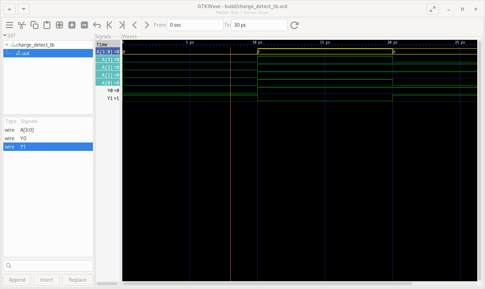

# Flujo de Trabajo para FPGA

Se implementó una funcionalidad básica de comparar dos valores (que representan la carga de dos baterías individuales) con el valor máximo y cero para accionar señales de carga completa y descarga total.

La implementación se realizó en el archivo charge_detect.v y 2b.v. Se realizaron puebas descritas en charge_detect_tb.v.

El módulo charge_detect se utilizó en dos casos en el módulo 2b

## Pruebas

Se realizaron pruebas de funcionamiento básico del modulo comparador.

