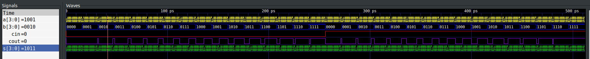
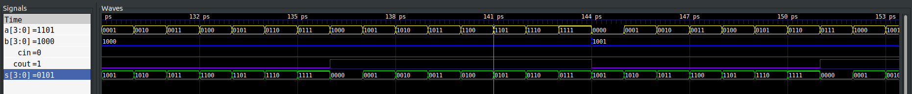
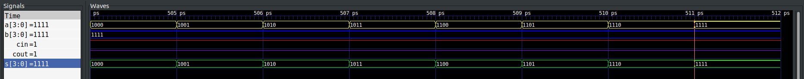

# Laboratorio 2: Medidor de carga
### Objetivos de aprendizaje

- Comprender los principios básicos de la lógica digital, como puertas lógicas, decodificadores y sumadores, y cómo estos se implementan en una FPGA. 
- Construir e instanciar módulos en Verilog para implementar un sistema completo en FPGA.
- Aprender a verificar el funcionamiento del diseño en un entorno de simulación antes de implementar en hardware.

### Monitoreo del estado de carga de una batería.

### Planteamiento del problema.

Se requiere implementar un sistema que de aviso del nivel de carga de un banco de baterías que cuenta con dos baterías. El nivel de carga total del banco esta dado por la suma del nivel de carga de cada batería. 

Estas baterías cuentan cada una con un sensor de tensión que entrega valores entre 0 y 15 en sistema binario, dependiendo del nivel de carga de cada una, donde: 

0000 (0)  ---> Batería completamente descargada.
1111 (15) ---> Batería Completamente cargada.

### Requisitos funcionales.

**1. Aviso de carga crítica:** Si la carga total del banco de baterías es igual o menor que el 10% de la carga máxima, se debe activar una señal de advertencia, ya sea visual, auditiva o ambas.

**2. Detección de baterías descargadas:** Si una de las baterías tiene una carga de 0 (0000), debe generarse una señal de advertencia para así poderla atender.

**3. Otros niveles de carga:** Queda a consideración de cada grupo proponer cuando el nivel de carga del banco esta en un nivel moderado y suficiente y asi mismo generar una alerta visual diferente para cada uno. 

**4. Implementación modular:** El diseño se debe dividir en varios módulos para organizar el código y hacer el sistema escalable y claro. Queda a consideración de cada grupo cómo dividir las funcionalidades del diseño.

*****

## Solución planteada

El problema se resolvió usando módulos interconectados en tres niveles:

### Módulo de detección de descarga individual

Se implementó de forma estructural con la definición de función booleana que indica la descarga total de una batería, mediante la señal visual de un led. Se usa uno por cada batería del banco.

### Módulo monitor de banco

se realizó mediante un sumador de 4 bits donde cada entrada representa el nivel de carga del sensor de cada batería.

implementado de forma estructural mediante la reutilización de 1 sumador de 1 bit conectado de forma encadenada con una respuesta de 5 bits que represnta el nivel del banco de baterías.

### Módulo de comparación

Determina 5 estados sobre la carga del banco de baterías:

- crítico :   menor al 10%
- bajo    : del 10% al 30%
- medio   : del 30% al 60%
- alto    : del 60  al 99%
- completo: 100%

Por cada estado coloca una señal visual mediante un led.

fue implementado de forma comportamental usando múltiples ramas implementadas mediante declaraciones _if else if_, y operadores de comparación (_<, >, ==_) y lógicos (_&&_) y concatenación de bits.

## Módulos

### Semi sumador

Un **semi-sumador** es un circuito combinacional básico  que realiza la suma de dos bits (A y B). Este circuito tiene dos salidas principales: 

1. **Suma (S):** Representa el resultado de la suma de los bits de entrada.  
2. **Carry (C o Cout):** Indica si hay un acarreo que se genera como resultado de la suma.

#### Ecuaciones Lógicas
- **Suma (S):** `S = A ⊕ B` (operador XOR, suma exclusiva).  
- **Carry (C):** `C = A ⋅ B` (operador AND, producto lógico).

#### Tabla de Verdad

| Entrada A | Entrada B | S (Suma) | C (Carry) |
|-----------|-----------|----------|-----------|
| 0         | 0         | 0        | 0         |
| 0         | 1         | 1        | 0         |
| 1         | 0         | 1        | 0         |
| 1         | 1         | 0        | 1         |

#### Características
Un semi-sumador **no puede manejar un acarreo de entrada**, lo que lo diferencia de un **sumador completo** (*full adder*). Pero este sera nuestro punto de partida para construir un sumador completo y posteriormente el sumador de 4 bits . 
#### Implementacion en verilog 
Este módulo representa la lógica de un semi-sumador, que realiza la suma de dos bits y genera las salidas correspondientes sin considerar un acarreo de entrada.[modulo SemiSumador](./semi_add.v)
#### Implementacion del testbench
Al ejecutar el archivo [modulo SemiSumador testbench](./semi_add.v)

### Sumador Completo

Un **sumador completo** (*full adder*) es un circuito combinacional que realiza la suma de tres bits: dos bits de entrada ($A$ y $B$) y un bit de acarreo de entrada ($Cin$). A diferencia del **semi-sumador**, el sumador completo puede manejar este acarreo de entrada adicional.

#### Implementación Basada en Semi-Sumadores
Un sumador completo puede construirse combinando dos **semi-sumadores** y una compuerta OR. La idea es usar los semi-sumadores para realizar la suma de $A$, $B$ y $Cin$, y luego combinar los acarreos generados.

#### Estructura Lógica
1. El **primer semi-sumador** toma $A$ y $B$ como entradas:
   - Calcula la **suma parcial** $S1 = A \oplus B$.
   - Calcula el **acarreo parcial** $C1 = A \cdot B$.

2. El **segundo semi-sumador** toma $S1$ y $Cin$ como entradas:
   - Calcula la **suma final** $S = S1 \oplus Cin$.
   - Calcula el **acarreo parcial** $C2 = S1 \cdot Cin$.

3. Una **compuerta OR** combina los acarreos parciales $C1$ y $C2$:
   - Calcula el **acarreo final** $Cout = C1 + C2$.

### Ecuaciones Resultantes
- **Suma ($S$):** $S = A \oplus B \oplus Cin$
- **Acarreo ($Cout$):** $Cout = (A \cdot B) + (Cin \cdot (A \oplus B))$

## Tabla de Verdad del Sumador Completo

| Entrada A | Entrada B | Cin (Acarreo de Entrada) | S (Suma) | Cout (Acarreo de Salida) |
|-----------|-----------|--------------------------|----------|--------------------------|
| 0         | 0         | 0                        | 0        | 0                        |
| 0         | 0         | 1                        | 1        | 0                        |
| 0         | 1         | 0                        | 1        | 0                        |
| 0         | 1         | 1                        | 0        | 1                        |
| 1         | 0         | 0                        | 1        | 0                        |
| 1         | 0         | 1                        | 0        | 1                        |
| 1         | 1         | 0                        | 0        | 1                        |
| 1         | 1         | 1                        | 1        | 1                        |

La implementación basada en semi-sumadores es modular, lo que facilita la comprensión, diseño y prueba del circuito. Además, los bloques de semi-sumadores pueden reutilizarse en diseños.
#### Implementacion en verilog 
Este módulo utiliza dos instancias del módulo de semi-sumador (semi_add) para dividir la operación en etapas [modulo Sumador Completo](./full_adder.v.v)
#### Implementacion del testbench
Al ejecutar el archivo [modulo Sumador Completo testbench](./full_adder_tb.v) y abrir el archivo VCD en gtkwave.Se tiene lo siguiente:

Como se puede apreciar en la imagen es un comportamiento esperado acorde con la tabla de verdad desarrollada anteriormente. 

## Sumador de 4 bits

Un **sumador de 4 bits** es un circuito combinacional que suma dos números binarios de 4 bits (\( A[3:0] \) y \( B[3:0] \)) y un acarreo de entrada opcional (\( Cin \)). Este sumador se implementa utilizando **sumadores completos** en cascada, con cada sumador completo procesando un par de bits y propagando el acarreo entre las etapas.

### Funcionamiento General
1. **Entradas y Salidas:**
   - **Entradas:**
     - `A[3:0]`: Operando de 4 bits.
     - `B[3:0]`: Operando de 4 bits.
     - `Cin`: Acarreo inicial (opcional).
   - **Salidas:**
     - `S[3:0]`: Resultado de la suma de los bits correspondientes de \( A \) y \( B \), incluyendo el acarreo.
     - `Cout`: Acarreo de salida del bit más significativo (etapa final).

2. **Etapas:**
   - Cada bit de los operandos \( A[i] \) y \( B[i] \) se procesa en un **sumador completo**. 
   - El acarreo de salida (\( Cout \)) de una etapa se conecta como el acarreo de entrada (\( Cin \)) de la siguiente etapa.

### Diseño Interno
El sumador de 4 bits se construye con cuatro instancias de **sumadores completos**, conectados en cascada. La suma y acarreo de cada etapa se calculan como sigue:

1. **Primera Etapa (Bit 0):**
   - Calcula \( $S[0] = A[0] \oplus B[0] \oplus Cin$ \).
   - Genera \( $Cout_0 = (A[0] \cdot B[0]) + (Cin \cdot (A[0] \oplus B[0]))$\).

2. **Segunda Etapa (Bit 1):**
   - Calcula \( $S[1] = A[1] \oplus B[1] \oplus Cout_0$ \).
   - Genera \( $Cout_1$\), que se propaga a la siguiente etapa.

3. **Tercera y Cuarta Etapas (Bits 2 y 3):**
   - Cada etapa sigue el mismo proceso, usando el acarreo de la etapa previa como entrada.

4. **Salida Final:**
   - \( $S[3:0]$ \) contiene la suma completa.
   - \( $Cout$ \) representa el acarreo final.
### Resumen
- **Entrada:** Dos operandos de 4 bits \( $A$ \), \( $B$ \) y un acarreo de entrada \($Cin$ \).
- **Salida:** La suma de 4 bits \( $S[3:0]$ \) y un acarreo final (\( Cout \)).
- **Diseño:** El sumador se construye utilizando **sumadores completos** en cascada, donde cada uno calcula la suma de los bits y propaga el acarreo al siguiente bit más significativo.

### Implementacion en verilog 
Este módulo utiliza dos instancias del módulo de semi-sumador (semi_add) para dividir la operación en etapas [modulo Sumador de cuatro bits ](./four_bits_adder.v)
#### Implementacion del testbench
Al ejecutar el archivo [modulo Sumador de cuatro bits testbench](./four_bits_adder_tb.v) y abrir el archivo VCD en gtkwave.Se tiene lo siguiente:

La cantidad de salidas presentes en la imagen original dificulta la identificación visual de patrones de comportamiento adecuados. Para una mejor comprensión, se ha procedido a realizar un zoom en muestras aleatorias, centrándonos especialmente en la zona izquierda donde podemos ver el caso particular . Este análisis detallado permite corroborar que, en efecto, se cumple con los criterios establecidos en esa sección.

### Comparación

se implementó una declaración _always_ dentro de la cual se colocaron declaraciones _if-else if_ con operadores de comparación y lógicos ver: [modulo comparador](./comparator.v)

Se realizaron pruebas unitarias colocando un nivel para cada una de las regiones definidas y se verificó la respuesta de las señales de salida como se muestra en la siguiente gráfica 

## Integración

Como ya se tiene el sumador y la forma de hacer  comparaciones para diferentes niveles de carga se procede a implementar todo en un solo modulo que llamamos [lab2](./lab2.v).
Por otra parte en el archivo [lab2_tb](./lab2_tb.v) es donde esta los casos de prueba  y al ejecutarlo se obtiene lo siguiente:

###  Comprobacion de nivel critico de bateria:
Como ya se estbalecio previamente este nivel,se
